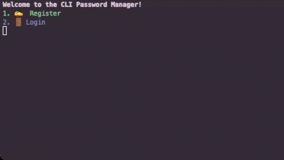

# 🔐 CLI Password Manager (Dart)

A secure, user-friendly command-line password manager built with **Dart** for seamless **cross-platform compatibility**. This tool enables individual users to **store, retrieve, and manage passwords locally**, with a strong focus on encryption and data safety.

## ✨ Key Features

- **Secure Local Storage**  
  All passwords are encrypted using **AES-GCM**, with keys derived from your master password using the **Argon2id** algorithm.

- **Strong Key Derivation with Argon2id**  
  Protects against brute-force and GPU-based attacks by securely deriving encryption keys from user passwords.

- **Multi-User Support**  
  Each user has a separate encrypted vault and salt file, ensuring data isolation on shared systems.

- **Password Retrieval**  
  Easily retrieve saved credentials after login, using a friendly terminal interface.

- **Cross-Platform CLI**  
  Written in Dart to run reliably on **Windows, macOS, and Linux**.

- **Vault Encryption**  
  Combines modern cryptographic practices—**AES-GCM**, **Argon2id**, and secure nonces—for safe local storage.

- **Simple Command-Line Workflow**  
  Straightforward interaction for registering users, logging in, managing passwords, and persisting encrypted data.

## 🚀 Getting Started

1. **Register or log in** to your account via the terminal.
2. **Add, retrieve, and remove** encrypted passwords tied to your user account.
3. **Vault files** are automatically saved (on Exit) per user and can be reloaded securely.


## Demo




## Run Locally

### Prerequisites

- Dart SDK installed. You can install it from [https://dart.dev/get-dart](https://dart.dev/get-dart).

### Steps
Clone the project

```bash
  git clone https://github.com/dkathrine/cli-password-manager
```

Go to the project directory

```bash
  cd cli-password-manager
```

Install dependencies

```bash
  dart pub get
```

Run the program

```bash
  dart run bin/main.dart
```

#### 🛠️ Compile to Executable (Optional)

```bash
  dart compile exe bin/main.dart -o cli-password-manager
```
For Windows:
```bash
  dart compile exe bin/main.dart -o cli-password-manager.exe
```

This will generate an executable named **cli-password-manager** (or **cli-password-manager.exe** on Windows) in the current directory.
```bash
  ./cli-password-manager
```
For Windows:
```bash
  ./cli-password-manager.exe
```